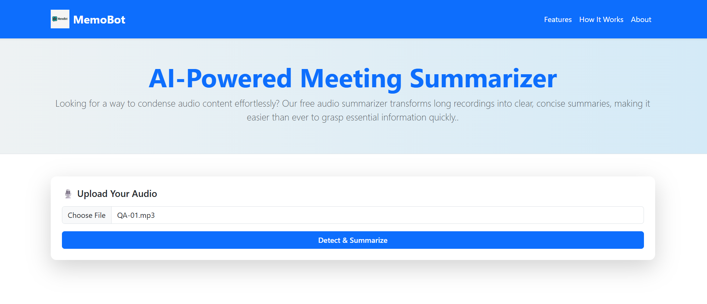
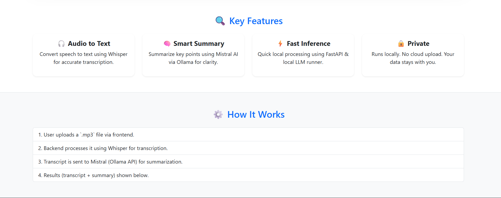
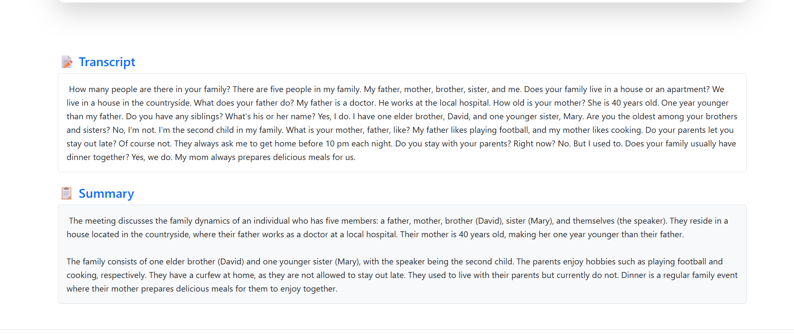

# AI-Powered Meeting Summarizer

A full-stack web application that **transcribes and summarizes meeting recordings** using state-of-the-art AI models. This project uses **Whisper ASR** for speech-to-text and **Mistral LLM** via Ollama for generating clear, concise meeting summaries — all running **locally** for privacy and speed.  

---

## 🛠 Technology Stack

### Frontend:
- **HTML5 & Bootstrap 5** – Responsive UI and layout  
- **JavaScript** – Dynamic content handling, file uploads, and progress loader  

### Backend:
- **Python 3.x**  
- **FastAPI** – High-performance API framework  
- **Uvicorn** – ASGI server for running the FastAPI app  

### AI Models:
- **Whisper ASR** – Accurate speech-to-text transcription  
- **Mistral via Ollama** – Large language model for summarization  

---

## ⚡ Features

- Upload **.mp3 meeting recordings**  
- Transcribe audio to text with **~87–90% accuracy** for clear audio  
- Generate **concise meeting summaries**  
- Responsive UI with **progress loader**  
- Runs **100% locally**, no external API dependency  
- **Future plans:**  
  - Add **speaker diarization**  
  - Real-time meeting summarization  

---

## 🎨 Demo

### Upload & Transcribe

## Demo Screenshots

### Front Page

### Main Page

### Generated Summary

